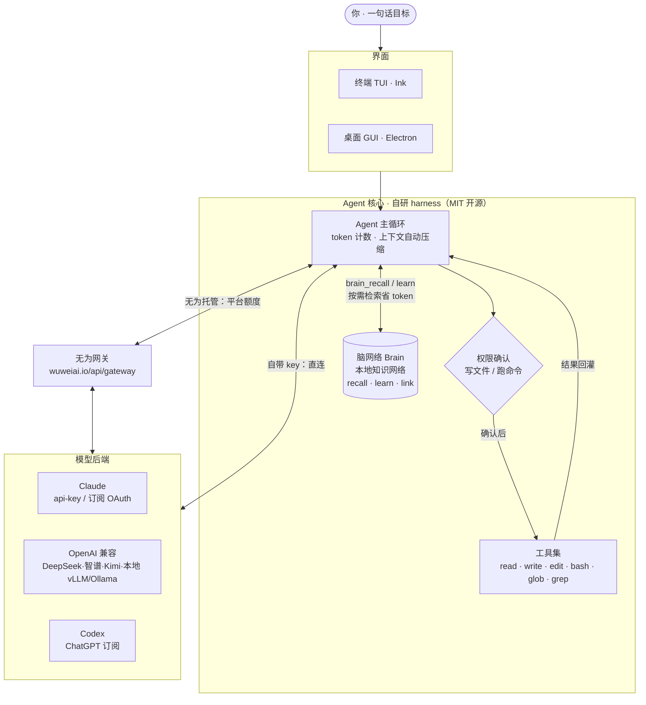

<div align="center">

# 无为 · Wuwei AI

**免费、开源、本地优先的 AI Agent 客户端**
*A free, open-source, local-first AI agent client*

一句话让 AI 替你干活：读写文件、精确编辑、跑命令、联网搜索 —— 每一步都带权限确认。
接 Claude / OpenAI / 国产大模型一键切换，自带你的 key，或用无为托管。国内直连，无需梯子。

[官网 Website](https://wuweiai.io) · [下载 Download](https://wuweiai.io) · [English](#english)

 

<br/>

<!-- 演示 GIF 占位：录一段「一句话 → AI 干完活」的操作，导出为 docs/demo.gif 后把下面 src 换成 docs/demo.gif -->


<sub>▶️ 演示占位 —— 录一段操作导出为 <code>docs/demo.gif</code>，替换上方图片即可</sub>

</div>

---

## 这是什么

无为是一个 **AI Agent**，不是补全、也不是聊天框。本质是：**大模型 + 工具执行循环 + 界面（终端 TUI / 桌面 GUI）**。

你说出目标，它自己去读文件、改代码、执行命令、联网查资料，把一件事从头做完——而模型壳（harness）全部自研、开源可审计，代码和数据留在你自己电脑上。

- 🆓 **真免费**：开箱即用，不订阅、不绑卡
- 💻 **本地优先**：项目和代码留在你机器上，不上传到你看不见的地方
- 🔍 **开源可审计（MIT）**：逻辑逐行可看，无隐藏遥测、无地域标记
- 🔌 **模型自由**：Claude / OpenAI 兼容端点 / 本地模型（vLLM、Ollama）/ 国产大模型，一键切换
- 🌏 **国内直连**：接国产模型不用梯子
- 🛡️ **权限确认**：写文件、跑命令前请求确认（`y` / `N` / `a`=以后总是允许该工具）
- 🧠 **脑网络（Brain）**：本地概念知识网络，沉淀项目 / 部署 / 踩坑等结构化知识，按需 `brain_recall` 检索子图，省 token 不必每次全量翻文档

## 脑网络（Brain · 本地知识网络）

一个跑在你本地的**概念知识网络**：把项目背景、git 路径、测试 / 线上环境、部署脚本位置、踩坑注意事项等**结构化沉淀**下来，需要时按需检索，而不是每次把整份文档塞进上下文。

- `brain_recall` — 按任务检索相关概念子图（+ 命中文档库的原文片段，只给摘要 + 路径）
- `brain_learn` / `brain_link` — 记住高价值知识、串联关系；同名覆盖纠正旧信息
- `brain_read_doc` — 需要全文时按路径读，不必全量扫

> 说明：脑网络为**无为托管 / 会员**能力，可在「知识网络」设置里开关、查看 / 覆盖其提示词。关闭后 `brain_*` 工具与说明一并停用。

## 架构

界面（TUI / GUI）→ 自研 Agent 主循环 → 工具执行（带权限确认）↔ 模型后端。
模型接入两条路：**自带 key 直连** 或 **无为托管网关**。



## 两种用法

1. **自带 Key（BYOK）** —— 填你自己的 API key 或本地端点，完全免费、数据不经过第三方。
2. **无为托管** —— 用平台额度，零配置直接用；未登录也能免费体验（详见[官网](https://wuweiai.io)）。

## 快速开始

### 桌面版（推荐）

到 [wuweiai.io](https://wuweiai.io) 下载对应系统的安装包（Windows / macOS / Linux），装好即用。

### 命令行 / 从源码运行

```bash
git clone https://github.com/wuwei-io/wuwei.git
cd wuwei
npm install

# 方式一：接 Claude API
export ANTHROPIC_API_KEY=sk-ant-...
export WUWEI_MODEL=claude-sonnet-5        # 可选
npm run dev

# 方式二：接本地 / OpenAI 兼容端点（vLLM / Ollama 等）
export WUWEI_BASE_URL=http://localhost:8000/v1
export WUWEI_MODEL=qwen3-coder
npm run dev
```

进入后直接输入需求。常用命令：`/reset` 清空对话 · `/exit` 退出。写文件 / 跑命令类操作会请求确认。

### 桌面版开发 / 打包

```bash
npm run desktop:dev          # 开发调试
npm run desktop:build        # 构建
npm run pack:wuwei           # 打 Windows 安装包
npm run desktop:pack         # 打 macOS 安装包
```

## 支持的模型后端

`anthropic`（API key）· `anthropic` + OAuth（Claude 订阅 / Claude Code）· `openai` 兼容（DeepSeek / 智谱 GLM / Kimi / MiniMax / 豆包 / 通义千问 / 腾讯混元 / Grok / 本地 vLLM·Ollama）· `codex`（ChatGPT 订阅）。各平台凭证分槽保存，底栏一键切换供应商 / 模型。

## 项目结构

```
src/                CLI（终端 TUI）
  index.tsx           入口：构造 Agent 并渲染 Ink 界面
  config.ts           从环境变量决定模型后端
  agent/
    loop.ts           Agent 主循环 + token 计数 + 上下文自动压缩
    provider.ts       多后端：anthropic / openai 兼容 / codex
    prompt.ts         系统提示词
  tools/index.ts      工具集：read / write / edit / bash / glob / grep
  ui/                 Ink TUI 组件
desktop/            桌面版（Electron）
  main/               主进程：供应商预设、账号额度、密钥保险箱
  renderer/           渲染层：多会话、流式、Markdown、图片
```

## 省额度

长任务不崩：超过模型窗口 `WUWEI_COMPACT_THRESHOLD`（默认窗口的 80%）自动把旧历史压缩成摘要；`WUWEI_KEEP_RECENT`（默认 6）保留最近条数。

## 贡献

欢迎 Issue 和 PR。提交前请跑 `npm run typecheck` 确保类型通过。

## 许可证

[MIT](./LICENSE) © 2026 Wuwei（无为）

---

<a name="english"></a>

## English

**Wuwei AI** is a free, open-source, local-first **AI agent** — not autocomplete, not a chat box. At its core: a large language model + a tool-execution loop + an interface (terminal TUI / desktop GUI).

Tell it what you want and it reads files, edits code, runs commands, and searches the web to finish the task — every step behind a permission prompt. The harness is fully open source (MIT); your code and data stay on your own machine.

- 🆓 **Genuinely free** — no subscription, no credit card
- 💻 **Local-first** — your code stays on your machine
- 🔍 **Open source (MIT)** — auditable line by line, no hidden telemetry
- 🔌 **Bring any model** — Claude, any OpenAI-compatible endpoint, local models (vLLM / Ollama), and more
- 🛡️ **Permission prompts** — confirm before writing files or running commands

**Two ways to use it:** bring your own API key (BYOK, fully free, data stays local), or use Wuwei's hosted credits (zero config — see [wuweiai.io](https://wuweiai.io)).

### Quick start

Download the desktop app for Windows / macOS / Linux at **[wuweiai.io](https://wuweiai.io)**, or run from source:

```bash
git clone https://github.com/wuwei-io/wuwei.git
cd wuwei && npm install
export ANTHROPIC_API_KEY=sk-ant-...   # or WUWEI_BASE_URL for a local/OpenAI-compatible endpoint
npm run dev
```

Licensed under [MIT](./LICENSE).
